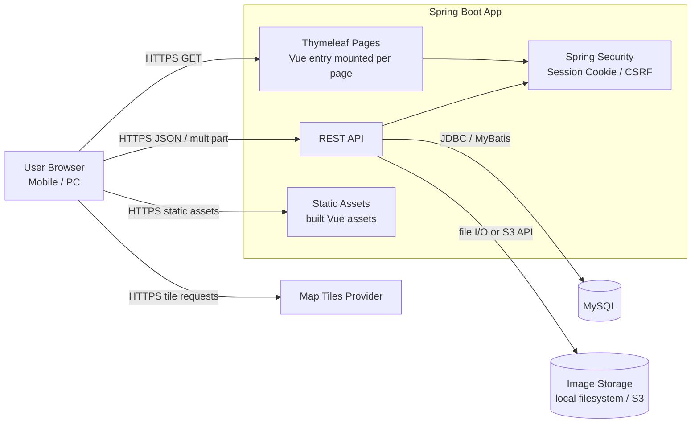
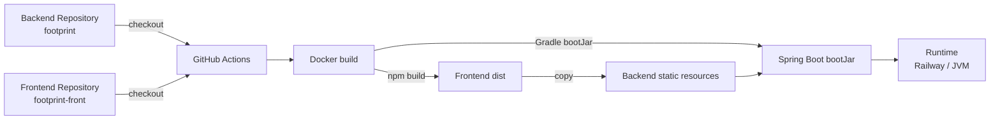
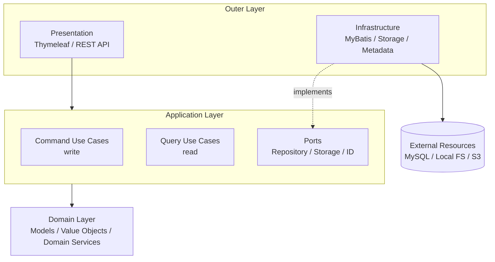
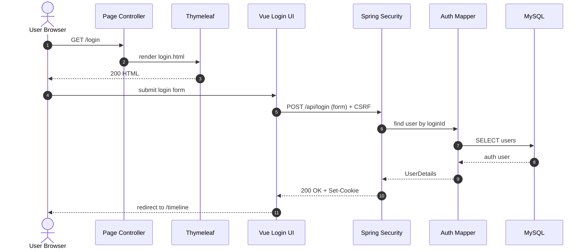
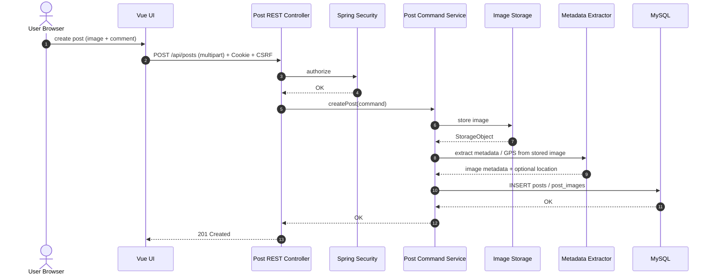
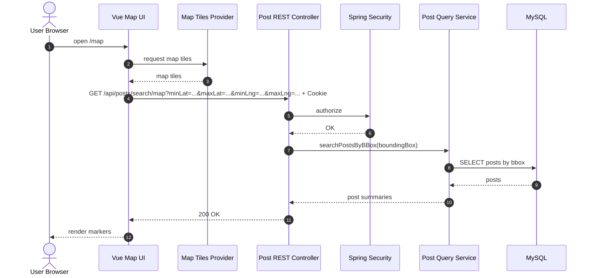

# アーキテクチャ構成

## 1. 実行時システム構成図

本システムは、Spring Boot アプリケーションが画面配信、API、認証、DBアクセス、画像保存を担う構成とする。
実行時の通信経路は、ブラウザ、Spring Boot アプリケーション、DB、画像ストレージ、地図タイル提供元に分けて整理する。

### 実行時構成補足

- 画面は Spring MVC / Thymeleaf が HTML を返し、各画面に対応する Vue entry を mount する。
- Vue Router は利用せず、画面遷移は MPA として `/timeline`, `/map`, `/search`, `/mypage` などの page endpoint へ遷移する。
- API は同一 Spring Boot アプリケーション内の REST Controller が提供する。
- local では frontend の Vite 開発サーバーを参照し、API は backend の `localhost:8080` へ proxy する。
- stg / prod では build 済み frontend asset を Spring Boot の static resource として配信する。
- DB は MySQL を利用し、アプリケーションから MyBatis 経由でアクセスする。
- 画像保存は local ではローカルファイルシステム、stg / prod では S3 を利用する。
- 画像配信は local では `/images/**`、stg / prod では S3 presigned URL を利用する。
- 地図タイルはブラウザから Map Tiles Provider へ直接取得する。
- ログはアプリケーションログ、認証・認可ログ、アクセスログに分類して出力する。

## 2. ビルド・デプロイ構成図

ビルド・デプロイでは、backend と frontend の各リポジトリを取得し、frontend build 成果物を backend の static 配下へ取り込んだ上で、Spring Boot アプリケーションとしてデプロイする。
この図は実行時通信ではなく、成果物生成と配置の流れを表す。

### ビルド・デプロイ補足

- backend は `footprint` リポジトリで管理し、Spring Boot アプリケーション、DB migration、Dockerfile、デプロイ workflow を含む。
- frontend は `footprint-front` リポジトリで管理し、Vue entry と静的 asset の build を担当する。
- stg / prod では frontend build 成果物を backend の static 配下へ同梱し、単一アプリケーションとして配信する。
- デプロイ成果物は backend と frontend build 産物を同梱した 1 つのアプリケーションとして扱う。

## 3. アプリケーション内部構成図

アプリケーション内部は、DDD を前提に Domain を中心へ置き、Application がユースケースを実行し、Presentation / Infrastructure が外側から接続する構成とする。
この図は実装クラスの網羅ではなく、DDD + Onion Architecture + CQRS の依存方向を表す。状態変更系と参照系は CQRS として分け、Command はドメインモデルを通して状態変更を行い、Query は参照用途の service / mapper で読み取りを行う。

### 内部構成補足

- Domain は外側の層に依存しない。
- Application はユースケースの流れを制御し、Domain と port に依存する。
- Command 系はドメインモデル、値オブジェクト、ドメインサービスを通して状態変更を行う。
- Query 系は参照用途の Query Service / Mapper で読み取りを行い、画面/API 用の参照モデルへ変換する。
- Infrastructure は Application / Domain 側で定義した port を実装し、MySQL、S3、local filesystem などへ接続する。
- Presentation は HTTP の入口であり、業務判断は Application / Domain へ委譲する。
- 認証・認可は Spring Security による横断的関心事として扱い、この内部構成図では独立した adapter として表現しない。

### 主要 endpoint

#### Page Controller

- `GET /`：インデックス画面
- `GET /login`：ログイン画面
- `GET /timeline`：タイムライン画面
- `GET /map`：投稿マップ画面
- `GET /search`：検索画面
- `GET /mypage`：マイページ画面

#### API / Security Endpoint

##### posts

- `GET /api/posts`：タイムライン投稿一覧取得
- `GET /api/posts/search`：投稿検索
- `GET /api/posts/search/map`：地図表示用の投稿検索
- `GET /api/posts/{postId}`：投稿詳細取得
- `GET /api/posts/{postId}/replies`：投稿に対する返信一覧取得
- `POST /api/posts`：投稿作成

##### replies

- `GET /api/replies/{parentReplyId}`：返信に対する子返信一覧取得
- `POST /api/replies/{postId}/reply`：投稿または返信への返信作成

##### users

- `GET /api/users/me`：ログインユーザー情報取得
- `GET /api/users/me/posts`：ログインユーザーの投稿一覧取得
- `GET /api/users/me/replies`：ログインユーザーの返信一覧取得
- `POST /api/users`：ユーザー登録

##### auth

- `POST /api/login`
- `POST /api/logout`

補足：`POST /api/login`、`POST /api/logout` は Controller ではなく Spring Security filter chain が処理する。

## 4. 主要シーケンス図

### 4.1 ログイン

ログイン画面は Page Controller が返す。
ログイン送信は Vue UI から `POST /api/login` を呼び出し、Spring Security の filter chain が認証処理を行う。
認証成功時は session cookie が発行され、フロントエンドがタイムライン画面へ遷移する。

### 4.2 投稿作成

投稿作成は Vue UI から multipart API を呼び出す。
Application Service は画像を保存し、保存済み画像からメタデータと GPS 情報を抽出し、投稿・画像情報・位置情報を DB に保存する。

### 4.3 地図検索

地図画面は Leaflet を利用する。
ブラウザは地図タイルを Map Tiles Provider から取得し、表示中の地図範囲をもとに投稿検索 API を呼び出す。

## 5. 認証・公開範囲

- 認証は Spring Security の session cookie を利用する。
- CSRF 対策は Spring Security の仕組みを利用する。
- `POST /api/login` と `POST /api/users` は未認証で呼び出せる。
- ログイン画面、サインアップ導線、静的アセット、ヘルスチェックを除き、画面・API は原則認証必須とする。
- OpenAPI / Swagger UI は local / stg で有効化する。未認証で参照できるのは local / dev 起動時のみとし、stg では認証後に参照する。

## 6. 補足

- 投稿、返信、ユーザー API は `public_id` / ULID を公開識別子として利用する。
- 返信取得はトップレベル返信とネスト返信で API 経路を分ける。
- 投稿検索はタイムライン、キーワード検索、地図 bbox 検索の API 経路を分ける。
- フロントエンドとバックエンドは別リポジトリで管理するが、stg / prod のデプロイ成果物は backend と frontend build 産物を同梱した 1 つのアプリケーションとして扱う。
