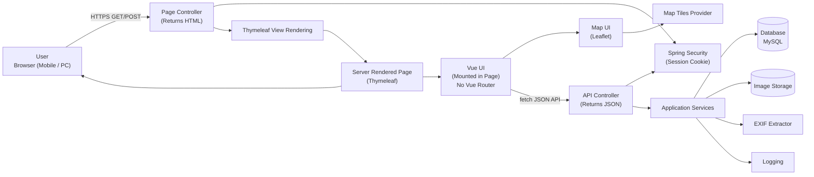
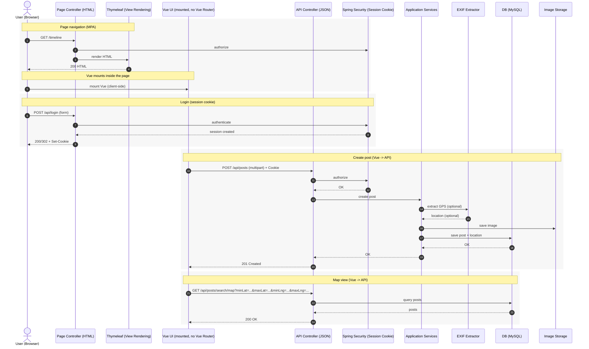

# アーキテクチャ構成

### Controller例

- Page Controller
    - GET /login
    - GET /
    - GET /timeline
    - GET /map
    - GET /search
    - GET /mypage

- API Controller
    - GET /api/posts
    - GET /api/posts/search
    - GET /api/posts/search/map
    - GET /api/posts/{postId}/replies
    - GET /api/replies/{parentReplyId}
    - GET /api/users/me
    - GET /api/users/me/posts
    - GET /api/users/me/replies
    - POST /api/posts
    - POST /api/replies/{postId}/reply
    - POST /api/users
    - POST /api/login
    - POST /api/logout

### 図の補足
- 認証：Spring Security によるセッションCookie
- 公開範囲：ログイン画面、サインアップ導線、静的アセット、ヘルスチェック以外は原則認証必須
- 画像：アップロード後にEXIF（GPS）を抽出し、投稿に位置情報を紐付ける
- 地図：フロントでLeafletを用いて表示し、投稿データはAPIから取得する
- ログ：アプリ/認証/アクセスを分類して出力する（出力先はデプロイ方式決定後に確定）
- frontend は別リポジトリで管理し、Docker build 時に build 成果物を backend へ取り込む
- 投稿/返信/ユーザー API は `public_id` / ULID を公開識別子として利用する
- 返信取得はトップレベル返信とネスト返信で API 経路を分ける
